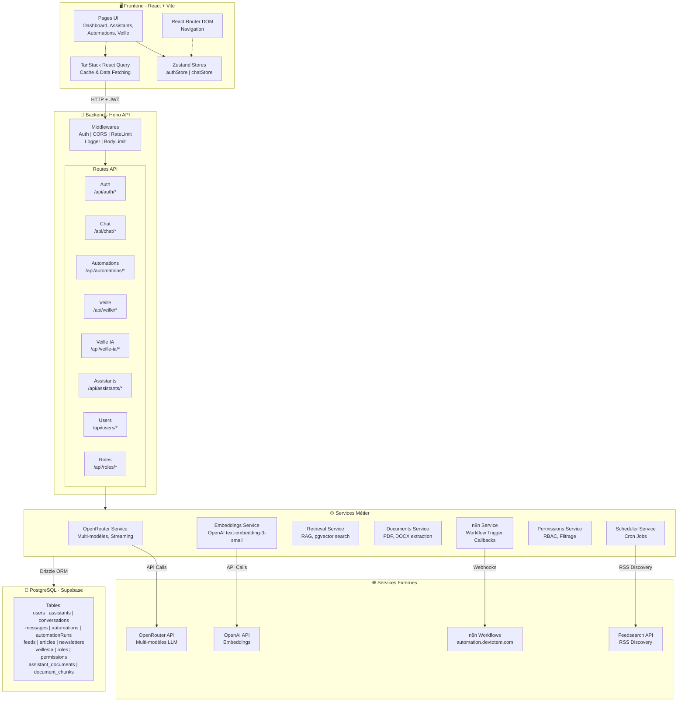
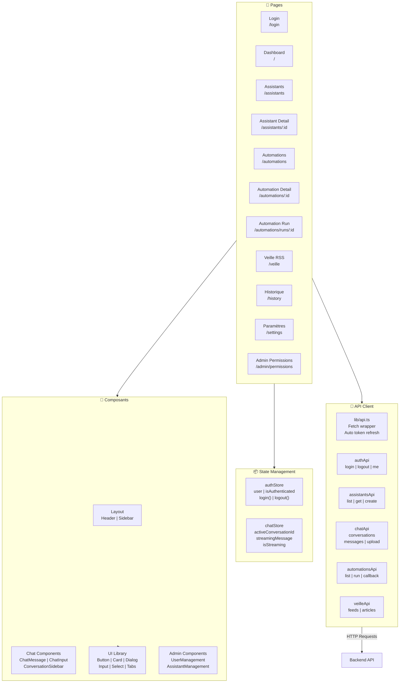
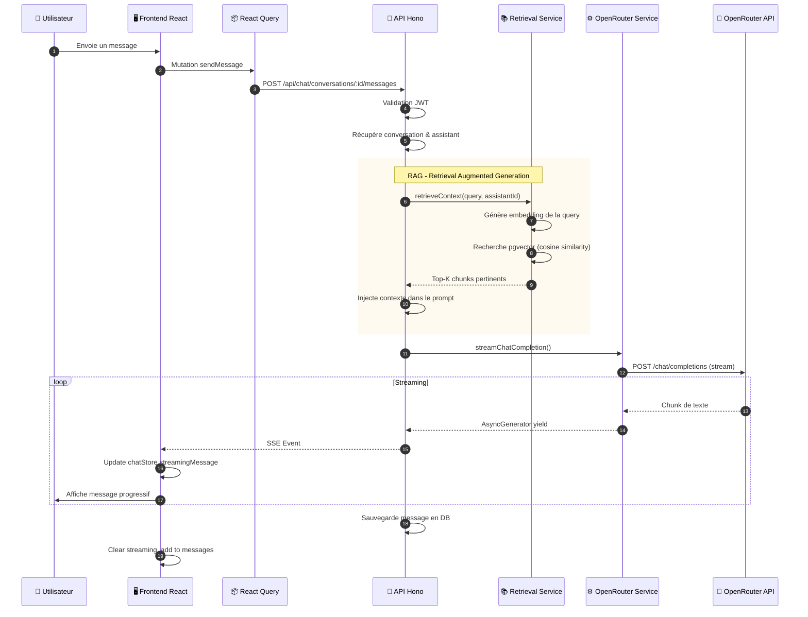
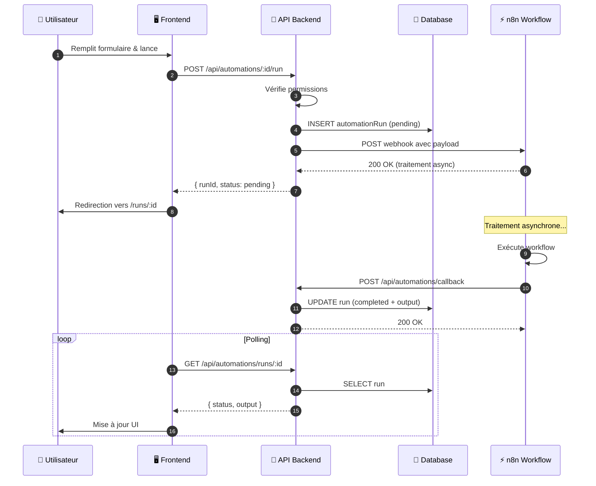
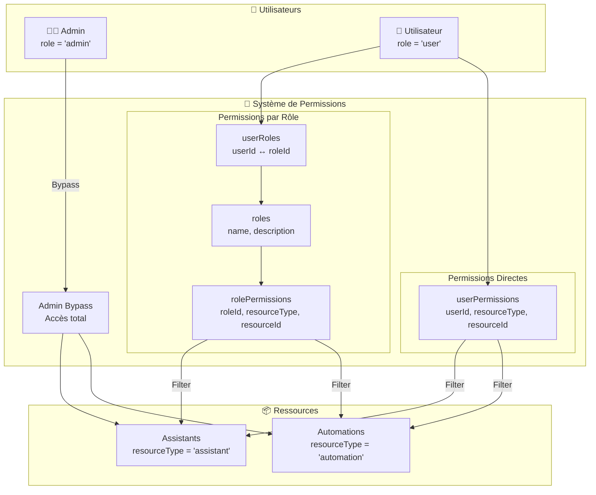
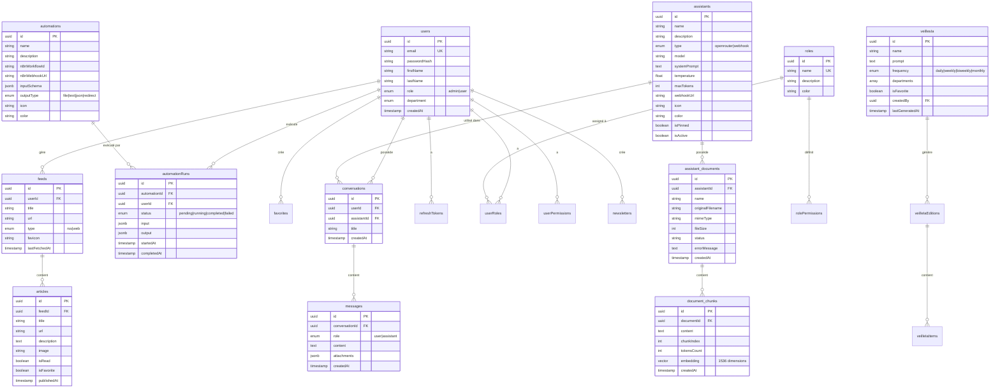
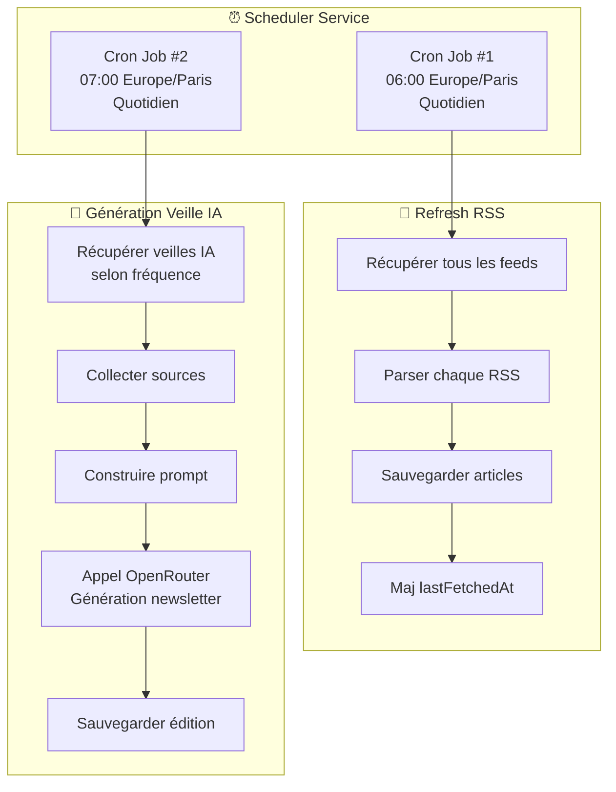
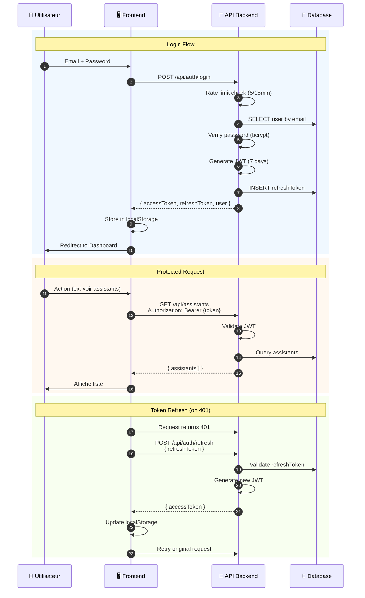
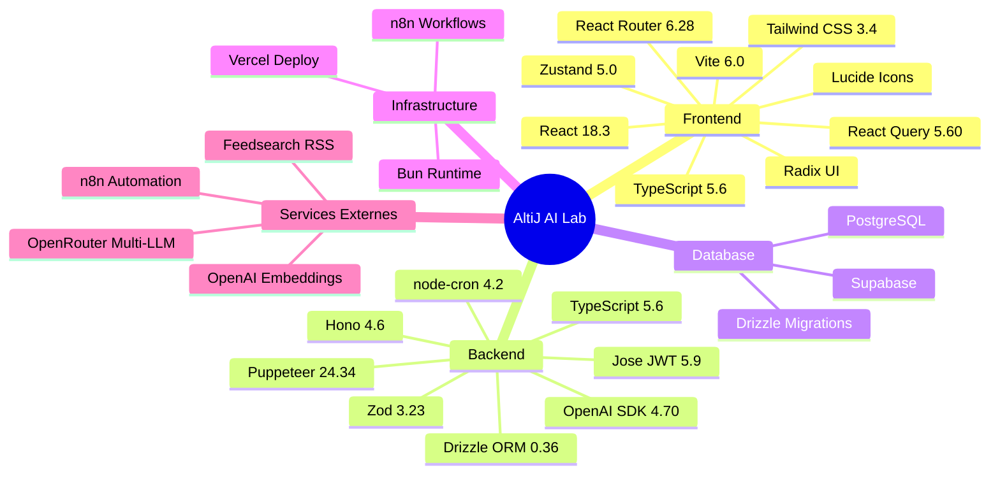

# AltiJ AI Lab - Diagrammes d'Architecture

## 1. Architecture Globale du Système

## 2. Architecture Frontend Détaillée

## 3. Architecture Backend Détaillée

```mermaid
graph TB
    subgraph Middleware["🛡️ Middleware Stack"]
        Logger["Logger<br/>Request logging"]
        CORS["CORS<br/>Cross-origin"]
        SecHeaders["Secure Headers<br/>Security"]
        BodyLimit["Body Limit<br/>10MB max"]
        RateLimit["Rate Limit<br/>100 req/min"]
        AuthMW["Auth Middleware<br/>JWT Validation"]
        AdminMW["Admin Middleware<br/>Role check"]
    end

    subgraph Routes["🛤️ API Routes"]
        direction LR
        R1["POST /api/auth/login"]
        R2["GET /api/assistants"]
        R3["POST /api/chat/conversations/:id/messages"]
        R4["POST /api/automations/:id/run"]
        R5["GET /api/veille/feeds"]
        R6["POST /api/veille-ia"]
    end

    subgraph Services["⚙️ Business Services"]
        AuthSvc["auth.ts<br/>JWT generation<br/>Password verify"]
        OpenRouterSvc2["openrouter.ts<br/>Multi-modèles<br/>Streaming responses"]
        EmbeddingsSvc2["embeddings.ts<br/>OpenAI embeddings<br/>Chunking"]
        RetrievalSvc2["retrieval.ts<br/>pgvector search<br/>RAG context"]
        DocumentsSvc2["documents.ts<br/>PDF, DOCX extraction"]
        N8nSvc["n8n.ts<br/>Webhook trigger<br/>Payload formatting"]
        PermSvc["permissions.ts<br/>hasAccess()<br/>getAccessibleIds()"]
        SchedulerSvc["scheduler.ts<br/>Cron: RSS refresh<br/>Cron: Veille IA"]
    end

    subgraph Database["💾 Database Layer"]
        Drizzle["Drizzle ORM<br/>Type-safe queries"]
        Schema["Schema<br/>Tables & Relations"]
        Migrations["Migrations<br/>Version control"]
    end

    Request["HTTP Request"] --> Middleware
    Middleware --> Routes
    Routes --> Services
    Services --> Database
    Database --> PostgreSQL["PostgreSQL"]
```

## 4. Flux de Données - Conversation Chat (avec RAG)

## 5. Flux de Données - Exécution Automation

## 6. Système de Permissions (RBAC)

## 7. Schéma de Base de Données

## 8. Architecture des Cron Jobs (Scheduler)

## 9. Flux d'Authentification

## 10. Stack Technologique Complète

