# AltiJ AI Lab - Diagrammes d'Architecture

## 1. Architecture Globale du Système

```mermaid
graph TB
    subgraph Client["🖥️ Frontend - React + Vite"]
        UI["Pages UI<br/>Dashboard, Assistants,<br/>Automations, Veille"]
        Zustand["Zustand Stores<br/>authStore | chatStore"]
        RQ["TanStack React Query<br/>Cache & Data Fetching"]
        Router["React Router DOM<br/>Navigation"]
    end

    subgraph API["🔧 Backend - Hono API"]
        MW["Middlewares<br/>Auth | CORS | RateLimit<br/>Logger | BodyLimit"]

        subgraph Routes["Routes API"]
            AuthR["Auth<br/>/api/auth/*"]
            ChatR["Chat<br/>/api/chat/*"]
            AutoR["Automations<br/>/api/automations/*"]
            VeilleR["Veille<br/>/api/veille/*"]
            VeilleIAR["Veille IA<br/>/api/veille-ia/*"]
            AssistR["Assistants<br/>/api/assistants/*"]
            UsersR["Users<br/>/api/users/*"]
            RolesR["Roles<br/>/api/roles/*"]
        end
    end

    subgraph Services["⚙️ Services Métier"]
        OpenRouterSvc["OpenRouter Service<br/>Multi-modèles, Streaming"]
        EmbeddingsSvc["Embeddings Service<br/>OpenAI text-embedding-3-small"]
        RetrievalSvc["Retrieval Service<br/>RAG, pgvector search"]
        DocumentsSvc["Documents Service<br/>PDF, DOCX extraction"]
        N8nSvc["n8n Service<br/>Workflow Trigger,<br/>Callbacks"]
        PermSvc["Permissions Service<br/>RBAC, Filtrage"]
        SchedulerSvc["Scheduler Service<br/>Cron Jobs"]
    end

    subgraph DB["💾 PostgreSQL - Supabase"]
        Tables["Tables:<br/>users | assistants | conversations<br/>messages | automations | automationRuns<br/>feeds | articles | newsletters<br/>veillesIa | roles | permissions<br/>assistant_documents | document_chunks"]
    end

    subgraph External["🌐 Services Externes"]
        OpenRouter["OpenRouter API<br/>Multi-modèles LLM"]
        OpenAIEmb["OpenAI API<br/>Embeddings"]
        N8n["n8n Workflows<br/>automation.devtotem.com"]
        Feedsearch["Feedsearch API<br/>RSS Discovery"]
    end

    UI --> Zustand
    UI --> RQ
    RQ -->|"HTTP + JWT"| MW
    Router -.-> Zustand

    MW --> Routes
    Routes --> Services

    OpenRouterSvc -->|"API Calls"| OpenRouter
    EmbeddingsSvc -->|"API Calls"| OpenAIEmb
    N8nSvc -->|"Webhooks"| N8n
    SchedulerSvc -->|"RSS Discovery"| Feedsearch

    Services -->|"Drizzle ORM"| DB
```

## 2. Architecture Frontend Détaillée

```mermaid
graph TB
    subgraph Pages["📄 Pages"]
        Login["Login<br/>/login"]
        Dashboard["Dashboard<br/>/"]
        Assistants["Assistants<br/>/assistants"]
        AssistantDetail["Assistant Detail<br/>/assistants/:id"]
        Automations["Automations<br/>/automations"]
        AutoDetail["Automation Detail<br/>/automations/:id"]
        AutoRun["Automation Run<br/>/automations/runs/:id"]
        Veille["Veille RSS<br/>/veille"]
        History["Historique<br/>/history"]
        Settings["Paramètres<br/>/settings"]
        AdminPerms["Admin Permissions<br/>/admin/permissions"]
    end

    subgraph Components["🧩 Composants"]
        Layout["Layout<br/>Header | Sidebar"]
        ChatComps["Chat Components<br/>ChatMessage | ChatInput<br/>ConversationSidebar"]
        UILib["UI Library<br/>Button | Card | Dialog<br/>Input | Select | Tabs"]
        AdminComps["Admin Components<br/>UserManagement<br/>AssistantManagement"]
    end

    subgraph State["📦 State Management"]
        AuthStore["authStore<br/>user | isAuthenticated<br/>login() | logout()"]
        ChatStore["chatStore<br/>activeConversationId<br/>streamingMessage<br/>isStreaming"]
    end

    subgraph API_Client["🔌 API Client"]
        ApiLib["lib/api.ts<br/>Fetch wrapper<br/>Auto token refresh"]
        AuthAPI["authApi<br/>login | logout | me"]
        AssistAPI["assistantsApi<br/>list | get | create"]
        ChatAPI["chatApi<br/>conversations<br/>messages | upload"]
        AutoAPI["automationsApi<br/>list | run | callback"]
        VeilleAPI["veilleApi<br/>feeds | articles"]
    end

    Pages --> Components
    Pages --> State
    Pages --> API_Client
    Components --> UILib
    API_Client -->|"HTTP Requests"| Backend["Backend API"]
```

## 3. Architecture Backend Détaillée

```mermaid
graph TB
    subgraph Middleware["🛡️ Middleware Stack"]
        Logger["Logger<br/>Request logging"]
        CORS["CORS<br/>Cross-origin"]
        SecHeaders["Secure Headers<br/>Security"]
        BodyLimit["Body Limit<br/>10MB max"]
        RateLimit["Rate Limit<br/>100 req/min"]
        AuthMW["Auth Middleware<br/>JWT Validation"]
        AdminMW["Admin Middleware<br/>Role check"]
    end

    subgraph Routes["🛤️ API Routes"]
        direction LR
        R1["POST /api/auth/login"]
        R2["GET /api/assistants"]
        R3["POST /api/chat/conversations/:id/messages"]
        R4["POST /api/automations/:id/run"]
        R5["GET /api/veille/feeds"]
        R6["POST /api/veille-ia"]
    end

    subgraph Services["⚙️ Business Services"]
        AuthSvc["auth.ts<br/>JWT generation<br/>Password verify"]
        OpenRouterSvc2["openrouter.ts<br/>Multi-modèles<br/>Streaming responses"]
        EmbeddingsSvc2["embeddings.ts<br/>OpenAI embeddings<br/>Chunking"]
        RetrievalSvc2["retrieval.ts<br/>pgvector search<br/>RAG context"]
        DocumentsSvc2["documents.ts<br/>PDF, DOCX extraction"]
        N8nSvc["n8n.ts<br/>Webhook trigger<br/>Payload formatting"]
        PermSvc["permissions.ts<br/>hasAccess()<br/>getAccessibleIds()"]
        SchedulerSvc["scheduler.ts<br/>Cron: RSS refresh<br/>Cron: Veille IA"]
    end

    subgraph Database["💾 Database Layer"]
        Drizzle["Drizzle ORM<br/>Type-safe queries"]
        Schema["Schema<br/>Tables & Relations"]
        Migrations["Migrations<br/>Version control"]
    end

    Request["HTTP Request"] --> Middleware
    Middleware --> Routes
    Routes --> Services
    Services --> Database
    Database --> PostgreSQL["PostgreSQL"]
```

## 4. Flux de Données - Conversation Chat (avec RAG)

```mermaid
sequenceDiagram
    autonumber
    participant U as 👤 Utilisateur
    participant F as 🖥️ Frontend React
    participant RQ as 📦 React Query
    participant A as 🔧 API Hono
    participant R as 📚 Retrieval Service
    participant S as ⚙️ OpenRouter Service
    participant O as 🤖 OpenRouter API

    U->>F: Envoie un message
    F->>RQ: Mutation sendMessage
    RQ->>A: POST /api/chat/conversations/:id/messages
    A->>A: Validation JWT
    A->>A: Récupère conversation & assistant

    rect rgb(255, 250, 240)
        Note over A,R: RAG - Retrieval Augmented Generation
        A->>R: retrieveContext(query, assistantId)
        R->>R: Génère embedding de la query
        R->>R: Recherche pgvector (cosine similarity)
        R-->>A: Top-K chunks pertinents
        A->>A: Injecte contexte dans le prompt
    end

    A->>S: streamChatCompletion()
    S->>O: POST /chat/completions (stream)

    loop Streaming
        O-->>S: Chunk de texte
        S-->>A: AsyncGenerator yield
        A-->>F: SSE Event
        F->>F: Update chatStore.streamingMessage
        F->>U: Affiche message progressif
    end

    A->>A: Sauvegarde message en DB
    F->>F: Clear streaming, add to messages
```

## 5. Flux de Données - Exécution Automation

## 6. Système de Permissions (RBAC)

```mermaid
graph TD
    subgraph Users["👥 Utilisateurs"]
        Admin["👨‍💼 Admin<br/>role = 'admin'"]
        User["👤 Utilisateur<br/>role = 'user'"]
    end

    subgraph Permissions["🔐 Système de Permissions"]
        AdminBypass["Admin Bypass<br/>Accès total"]

        subgraph RoleBased["Permissions par Rôle"]
            UserRole["userRoles<br/>userId ↔ roleId"]
            Role["roles<br/>name, description"]
            RolePerm["rolePermissions<br/>roleId, resourceType, resourceId"]
        end

        subgraph DirectPerm["Permissions Directes"]
            UserPerm["userPermissions<br/>userId, resourceType, resourceId"]
        end
    end

    subgraph Resources["📦 Ressources"]
        Assistants["Assistants<br/>resourceType = 'assistant'"]
        Automations["Automations<br/>resourceType = 'automation'"]
    end

    Admin -->|"Bypass"| AdminBypass
    AdminBypass --> Assistants
    AdminBypass --> Automations

    User --> UserRole
    User --> UserPerm
    UserRole --> Role
    Role --> RolePerm
    RolePerm -->|"Filter"| Assistants
    RolePerm -->|"Filter"| Automations
    UserPerm -->|"Filter"| Assistants
    UserPerm -->|"Filter"| Automations
```

## 7. Schéma de Base de Données

## 8. Architecture des Cron Jobs (Scheduler)

```mermaid
graph TB
    subgraph Scheduler["⏰ Scheduler Service"]
        Cron1["Cron Job #1<br/>06:00 Europe/Paris<br/>Quotidien"]
        Cron2["Cron Job #2<br/>07:00 Europe/Paris<br/>Quotidien"]
    end

    subgraph Tasks1["📡 Refresh RSS"]
        GetFeeds["Récupérer tous les feeds"]
        FetchRSS["Parser chaque RSS"]
        SaveArticles["Sauvegarder articles"]
        UpdateTimestamp["Maj lastFetchedAt"]
    end

    subgraph Tasks2["🤖 Génération Veille IA"]
        GetVeilles["Récupérer veilles IA<br/>selon fréquence"]
        CollectSources["Collecter sources"]
        GeneratePrompt["Construire prompt"]
        CallOpenRouter["Appel OpenRouter<br/>Génération newsletter"]
        SaveEdition["Sauvegarder édition"]
    end

    Cron1 --> GetFeeds
    GetFeeds --> FetchRSS
    FetchRSS --> SaveArticles
    SaveArticles --> UpdateTimestamp

    Cron2 --> GetVeilles
    GetVeilles --> CollectSources
    CollectSources --> GeneratePrompt
    GeneratePrompt --> CallOpenRouter
    CallOpenRouter --> SaveEdition
```

## 9. Flux d'Authentification

```mermaid
sequenceDiagram
    autonumber
    participant U as 👤 Utilisateur
    participant F as 🖥️ Frontend
    participant A as 🔧 API Backend
    participant DB as 💾 Database

    rect rgb(240, 248, 255)
        Note over U,DB: Login Flow
        U->>F: Email + Password
        F->>A: POST /api/auth/login
        A->>A: Rate limit check (5/15min)
        A->>DB: SELECT user by email
        A->>A: Verify password (bcrypt)
        A->>A: Generate JWT (7 days)
        A->>DB: INSERT refreshToken
        A-->>F: { accessToken, refreshToken, user }
        F->>F: Store in localStorage
        F->>U: Redirect to Dashboard
    end

    rect rgb(255, 248, 240)
        Note over U,DB: Protected Request
        U->>F: Action (ex: voir assistants)
        F->>A: GET /api/assistants<br/>Authorization: Bearer {token}
        A->>A: Validate JWT
        A->>DB: Query assistants
        A-->>F: { assistants[] }
        F->>U: Affiche liste
    end

    rect rgb(248, 255, 240)
        Note over U,DB: Token Refresh (on 401)
        F->>A: Request returns 401
        F->>A: POST /api/auth/refresh<br/>{ refreshToken }
        A->>DB: Validate refreshToken
        A->>A: Generate new JWT
        A-->>F: { accessToken }
        F->>F: Update localStorage
        F->>A: Retry original request
    end
```

## 10. Stack Technologique Complète

